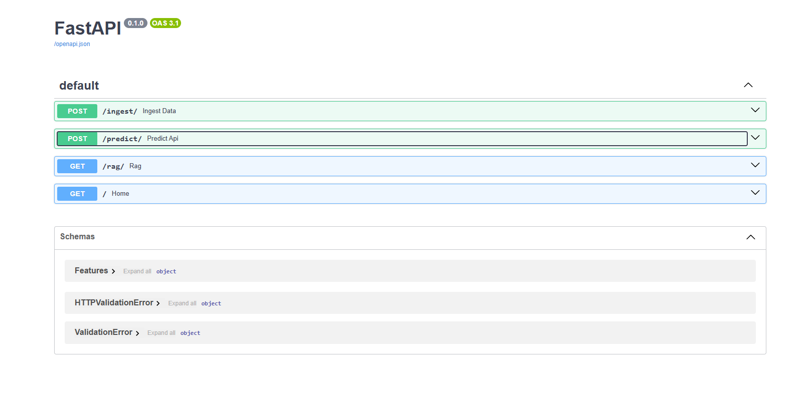

# AI Data Platform with ML and RAG

## Overview

This project implements a scalable backend system that integrates machine learning, APIs, and databases. It demonstrates how modern data platforms handle data ingestion, model inference, and information retrieval in a production-style architecture.

## Features

* Data ingestion API using FastAPI
* Machine learning prediction service
* Retrieval-based query system (RAG)
* PostgreSQL for structured data storage
* MongoDB for unstructured data storage
* Containerized services using Docker
## API Preview

## System Architecture

Client → FastAPI → PostgreSQL and MongoDB → ML Model → Response

## Tech Stack

* Backend: FastAPI (Python)
* Machine Learning: Scikit-learn
* Databases: PostgreSQL, MongoDB
* DevOps: Docker
* Data Processing: Pandas

## API Endpoints

* POST /ingest — Store input data
* POST /predict — Generate ML predictions
* GET /rag — Retrieve relevant information

## Setup Instructions

### 1. Clone the repository

git clone https://github.com/Dileep1704/ai-data-platform-ml-rag.git
cd ai-data-platform-ml-rag

### 2. Install dependencies

pip install -r requirements.txt

### 3. Start databases using Docker

docker-compose up -d

### 4. Run backend server

python -m uvicorn backend.main:app --reload

### 5. Access API documentation

http://127.0.0.1:8000/docs

## Design Considerations

* Modular backend structure for scalability
* Separation of concerns across API, ML, and database layers
* Use of both SQL and NoSQL databases for flexibility
* Containerized setup to simulate real deployment environments

## Future Improvements

* Cloud deployment (AWS or GCP)
* Authentication and authorization
* Frontend dashboard for visualization
* Advanced LLM-based RAG implementation

